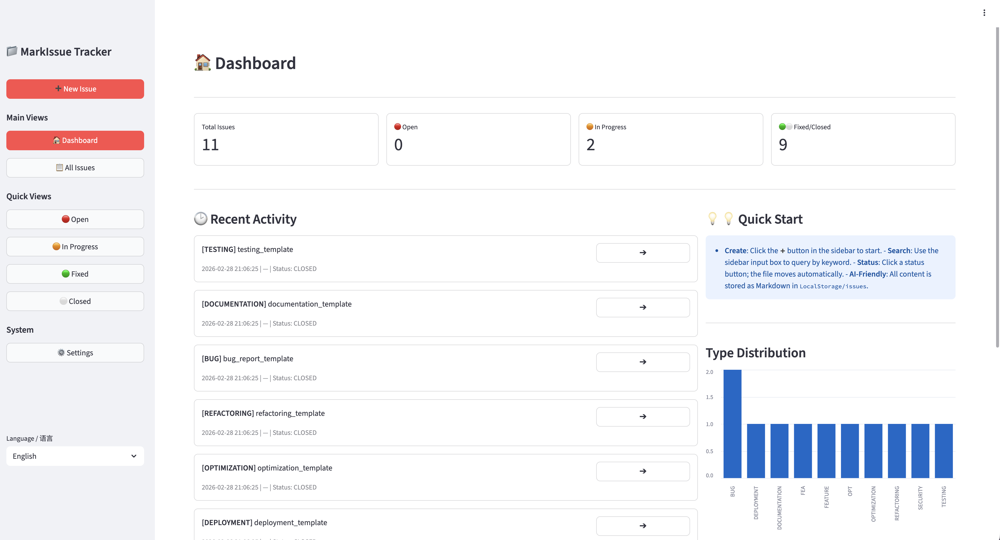
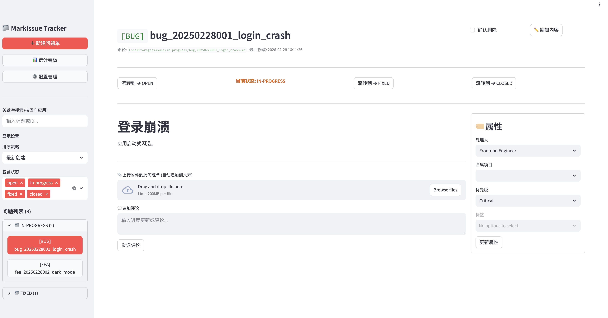
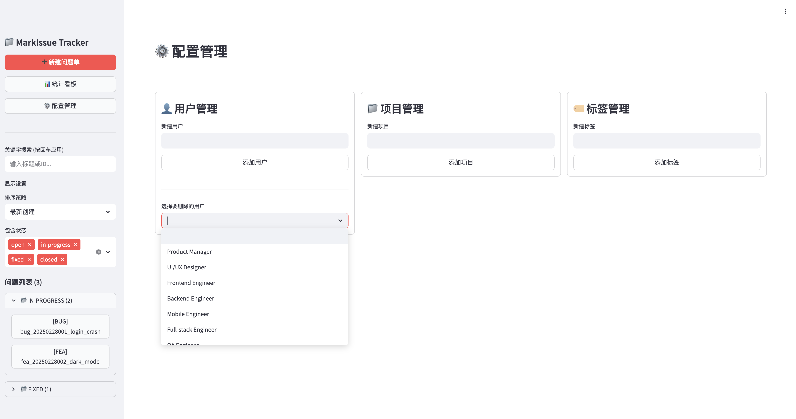

# 📁 MarkIssue

    

**MarkIssue** is a lightweight, zero-database agile issue tracker built on Markdown files. It is designed for individuals and small teams who want the full power of modern issue management without the overhead of a database or server to maintain.

[🚀 Live Demo](https://bf3tzdtgrlfvvhjche5nuf.streamlit.app/) • [中文说明 ↓](README.zh.md)

---

## 💡 Why MarkIssue?

- **Zero-Database**: Everything lives in plain `.md` and `.json` files. No PostgreSQL. No Redis.
- **AI-Native**: Your entire issue history is readable Markdown. Drop the `LocalStorage/` folder into any LLM and get instant analysis, summaries, and insights.
- **Clone & Run**: No auth system, no infra setup. One `pip install` and you're live.
- **Vibe Coding Ready**: Files are stored in a structure Cursor, Copilot, and GPT can fully browse and reason about.
- **Multi-Language UI**: Built-in **English / 中文** toggle. Browser locale is auto-detected on first visit.

---

## 🌟 Features

| Feature               | Description                                                       |
| --------------------- | ----------------------------------------------------------------- |
| 🏷️ Multi-tag system   | Attach custom tags (e.g. `frontend`, `urgent`) for fast filtering |
| 📊 Dashboard          | Auto-generated charts for status, type, and workload distribution |
| 💬 Quick comments     | Append comments in read mode without entering edit mode           |
| 📎 File attachments   | Drag-and-drop images → auto Markdown embed                        |
| ⚡ Batch operations   | Bulk status transition and metadata update                        |
| ⚙️ Config center      | Manage users, projects, and tags from the web UI                  |
| 🌍 i18n               | English / Chinese; auto-detects browser language                  |
| 🔒 Optimistic locking | Conflict detection when multiple users edit the same issue        |

---

## 📸 Screenshots

### Dashboard



### Issue Workbench



### Settings



---

## 🚀 Quick Start

### Option 1 — Local Run (recommended for dev/preview)

```bash
git clone https://github.com/fanszoro/markissue.git
cd markissue
pip install -r requirements.txt
streamlit run tracker_app.py --server.port 8505 --server.address 127.0.0.1
# Open http://localhost:8505
```

Or use the provided Makefile shortcut:

```bash
make run      # starts the app
make stop     # stops it
make test     # run the full test suite
make coverage # coverage report (target: 100% logic coverage)
```

### Option 2 — Docker (recommended for self-hosting)

```bash
docker compose up -d
# Data is persisted in ./LocalStorage on the host
```

### Option 3 — Streamlit Community Cloud (free, public)

1. Fork this repo
2. Go to [share.streamlit.io](https://share.streamlit.io), connect your fork
3. Set **Main file**: `tracker_app.py` → Deploy ✅

---

## ⚙️ Configuration

| Variable / Flag      | Description                              | Default        |
| -------------------- | ---------------------------------------- | -------------- |
| `MARKISSUE_DATA_DIR` | Data directory for Markdown & JSON files | `LocalStorage` |
| `--server.port`      | Streamlit port                           | `8505`         |
| `--server.address`   | Listen address (`0.0.0.0` for LAN)       | `localhost`    |

---

## 🌍 Language / i18n

MarkIssue auto-detects your browser's preferred language (`navigator.language`) on the **first visit** using `streamlit-javascript`. Supported languages:

| Code | Language          |
| ---- | ----------------- |
| `en` | English (default) |
| `zh` | 中文 (Chinese)    |

You can always switch the language with the **"Language / 语言"** selector at the top of the sidebar. The choice is persisted in the URL as `?lang=en` or `?lang=zh`.

To add a new language, edit `app/i18n.py` and add a new language code to `_STRINGS` and `LANG_OPTIONS`.

---

## 🧪 Testing

```bash
make coverage
# → 100.00% coverage on all logic modules
# → 38 tests, 0 failures
```

All business logic in `app/managers/` and `scripts/` is covered at 100%. The Streamlit presentation layer (`tracker_app.py`) is excluded from line coverage per standard practice for UI frameworks.

---

## 📁 Project Structure

```
markissue/
├── tracker_app.py          # Streamlit UI (entry point)
├── app/
│   ├── i18n.py             # Multi-language string dictionary
│   └── managers/
│       └── fs_issue_manager.py  # Core business logic (100% tested)
├── scripts/
│   └── generate_fs_test_data.py # Test data generator
├── tests/                  # Pytest suite
├── LocalStorage/           # Data directory (gitignored)
│   └── issues/
│       ├── open/
│       ├── in-progress/
│       ├── fixed/
│       └── closed/
├── docs/                   # Documentation
│   └── images/             # Screenshots
├── Makefile
├── docker-compose.yml
└── requirements.txt
```
